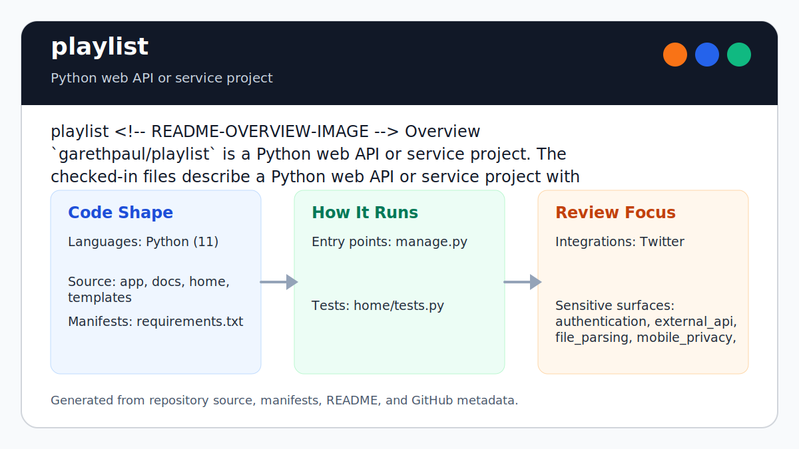

# playlist

<!-- README-OVERVIEW-IMAGE -->


## Overview

`garethpaul/playlist` is a legacy Django social/music integration sample for
connecting Twitter authentication, Beats, and Spotify-era playlist flows.

Runtime secrets are environment-driven. `DJANGO_DEBUG` defaults to off, and
`DJANGO_SECRET_KEY` is required unless `DJANGO_DEBUG=1` is explicitly set for
local development.

This README is based on the checked-in source, manifests, scripts, and repository metadata on the `master` branch. The project language mix found during review was: Python (11).

## Repository Contents

- `CHANGES.md` - baseline change log
- `.github/workflows/check.yml` - GitHub Actions baseline for `make check`
- `Makefile` - local verification entry point
- `README.md` - project overview and local usage notes
- `requirements.txt` - Python dependency or packaging metadata
- `app` - source or example code
- `docs/bugs` - tracked security findings and resolution notes
- `docs/plans` - completed baseline and follow-up plans
- `home` - source or example code
- `manage.py`
- `scripts/check-baseline.py` - static security baseline checks used by `make check`
- `SECURITY.md` - security reporting and disclosure guidance
- `templates` - source or example code
- `test_settings_security.py` - stdlib tests for environment-based settings
- `VISION.md` - project direction and maintenance guardrails

Additional scan context:

- Source directories: app, home, templates
- Dependency and build manifests: Makefile, requirements.txt
- Entry points or build surfaces: manage.py, Makefile
- Test-looking files: home/tests.py, test_settings_security.py

## Getting Started

### Prerequisites

- Git
- Python matching the era of the project

### Setup

```bash
git clone https://github.com/garethpaul/playlist.git
cd playlist
python -m pip install -r requirements.txt
make check
```

For local development without production secrets:

```bash
export DJANGO_DEBUG=1
python manage.py runserver
```

The setup commands above are derived from repository files. Legacy mobile, Python, or JavaScript samples may require older SDKs or package versions than a modern workstation uses by default.

## Running or Using the Project

- Run Django management commands through `python manage.py ...`.
- For non-debug execution set `DJANGO_SECRET_KEY` and `DJANGO_ALLOWED_HOSTS`.
- `DJANGO_ALLOWED_HOSTS=*` wildcard allowed hosts are rejected outside local
  debug.
- Session and CSRF cookies are marked secure outside local debug mode, so
  production deployments must terminate HTTPS before requests reach Django.
- Set Twitter, Beats, and Spotify credentials through environment variables
  before using the integration views.

## Testing and Verification

- `make check`
- `make lint`
- `make test`
- `make build`
- `make verify`
- `python3 scripts/check-baseline.py`
- `python3 test_settings_security.py -v`
- `python3 test_views_normalization.py -v`
- `python3 test_url_patterns.py -v`
- Pinned, credential-free, read-only GitHub Actions hosted Linux validation
  runs the dependency-free `make check` security baseline on Python 3.10 and
  3.12 without integration credentials or API calls.
- Local Make gates disable Python bytecode writes and reject leftover
  `__pycache__` or `.pyc` output.
- Legacy Django integration tests when the original dependency set is
  available

`make lint` runs the static security baseline, `make test` runs the
dependency-free settings and view-normalization tests, `make build` reruns the
static baseline as the local build gate, and `make verify` combines those
standard targets.

When the required SDK or runtime is unavailable, use static checks and source review first, then verify on a machine that has the matching platform toolchain.

## Configuration and Secrets

- Detected references to Twitter. Keep API keys, OAuth credentials, tokens, and account-specific values in local configuration only.
- Required outside local debug: `DJANGO_SECRET_KEY`.
- Blank `DJANGO_SECRET_KEY` values are rejected outside local debug mode.
- Production `DJANGO_SECRET_KEY` values must be at least 32 characters after
  trimming.
- `DJANGO_ALLOWED_HOSTS` is required outside local debug mode.
- `DJANGO_ALLOWED_HOSTS=*` wildcard allowed hosts are rejected outside local
  debug.
- Production session and CSRF cookies require HTTPS.
- Optional runtime controls: `DJANGO_DEBUG`, `DJANGO_ALLOWED_HOSTS`.
- Social credentials: `SOCIAL_AUTH_TWITTER_KEY`,
  `SOCIAL_AUTH_TWITTER_SECRET`, `TWITTER_ACCESS_TOKEN`,
  `TWITTER_ACCESS_TOKEN_SECRET`, `SOCIAL_AUTH_BEATS_KEY`,
  `SOCIAL_AUTH_BEATS_SECRET`, `SOCIAL_AUTH_SPOTIFY_KEY`, and
  `SOCIAL_AUTH_SPOTIFY_SECRET`.
- Do not commit `.env`, local settings modules, SQLite databases, access
  tokens, OAuth secrets, or captured user data.
- The Beats Music and legacy Twitter/social-auth integrations are retired or
  obsolete. The dependency-free gates validate security boundaries but do not
  establish that the historical provider flow is deployable on a supported
  Django/Python stack.

## Security and Privacy Notes

- Review changes touching authentication or token handling; examples from the scan include app/settings.py, app/urls.py, home/views.py, requirements.txt, and 2 more.
- Review changes touching external API calls or credential-adjacent configuration; examples from the scan include app/settings.py, home/views.py, requirements.txt, templates/base.html, and 4 more.
- Review changes touching network requests, sockets, or service endpoints; examples from the scan include app/settings.py, app/urls.py, app/wsgi.py, fabfile.py, and 6 more.
- Review changes touching file, media, JSON, XML, CSV, OCR, or data parsing; examples from the scan include templates/base.html, templates/beats.html, templates/login.html.
- `make check` verifies that the previously documented hardcoded
  `SECRET_KEY`, blank secret, and default debug-mode issues stay fixed.
- `DJANGO_ALLOWED_HOSTS` stays required outside local debug so production host
  validation cannot be omitted accidentally.
- Wildcard allowed hosts stay rejected outside local debug so production host
  validation remains explicit.
- Keep state-changing tweet, favorite, and playlist actions on POST paths with
  CSRF protection.
- Logout uses a CSRF-protected POST logout form instead of a GET link so
  session and social-auth cleanup stay user-initiated.
- Keep post input normalization in place so non-string post inputs and blank
  status text are skipped, and favorite actions only call Twitter for numeric
  tweet IDs.
- Skip malformed Beats search results before playlist entries are
  queued.
- Skip malformed Twitter mention text and bound cleaned Beats search queries to
  200 characters.
- Keep login and playlist routing on one dependency-free auth-state predicate:
  both Twitter and Beats connections are required before entering `/beats`.
- Shape-check and trim Twitter and Beats token metadata before API client
  construction so malformed nested records reach the existing missing-token
  boundary instead of raising raw key errors.
- Validate preview durations as bounded decimal seconds before rendering them
  into the player script; reject signs, exponents, executable punctuation,
  overlong values, and durations above one hour.
- Render provider-controlled player metadata and timing values through
  `textContent`; never interpret SDK callback values as HTML.
- Keep OAuth access tokens out of visible player controls; the legacy SDK may
  hold its token in memory, but the UI must not display or edit it.
- Keep the Twitter and Beats integration URL patterns as exact-match integration routes
  so prefix paths do not enter those views.
- Do not add debug print statements that expose mention text, track search
  terms, track results, OAuth tokens, or user-linked playlist data.

## Maintenance Notes

- Standard Make aliases resolve the checker and dependency-free test scripts
  from `Makefile`, so an absolute Makefile path works from another directory.
- See `SECURITY.md` for vulnerability reporting and safe research guidance.
- See `CHANGES.md`, `docs/bugs/`, and
  `docs/plans/2026-06-08-playlist-baseline.md` for the current
  security baseline.
- See `docs/plans/2026-06-09-post-only-logout.md` for the CSRF-protected POST
  logout guardrail.
- See `docs/plans/2026-06-09-make-gate-aliases.md` for the local Make gate
  aliases.
- See `docs/plans/2026-06-10-ci-baseline.md` for the lightweight GitHub
  Actions baseline.
- See `docs/plans/2026-06-10-hosted-security-validation.md` for the pinned
  Python matrix and no-credential validation boundary.
- See `docs/plans/2026-06-10-malformed-beats-results.md` for the malformed
  Beats search result guardrail.
- See `docs/plans/2026-06-10-malformed-twitter-mentions.md` for the Twitter
  mention search normalization guardrail.
- See `docs/plans/2026-06-13-auth-state-routing.md` for the shared integration
  auth-state routing contract.
- See `VISION.md` for project direction and contribution guardrails.

## Contributing

Keep changes small and tied to the project that is already present in this repository. For code changes, document the toolchain used, avoid committing generated dependency directories or local configuration, and update this README when setup or verification steps change.
